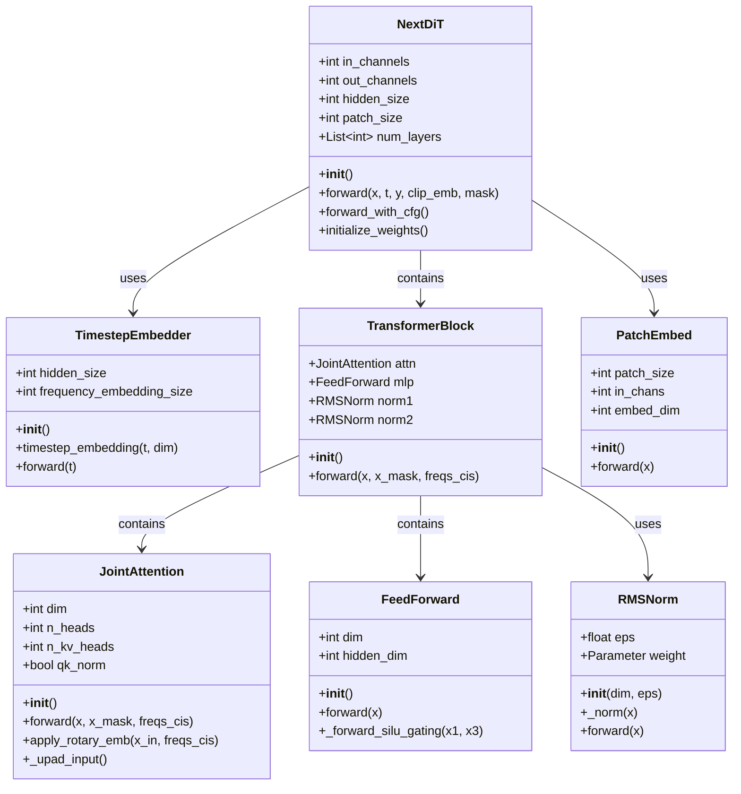
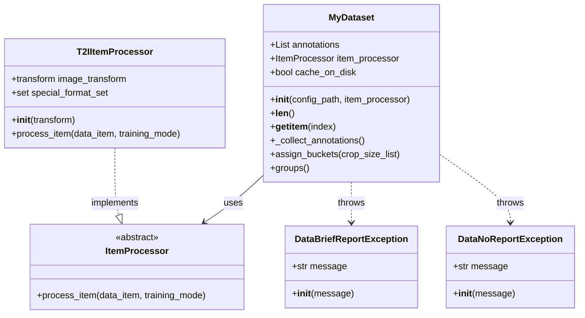
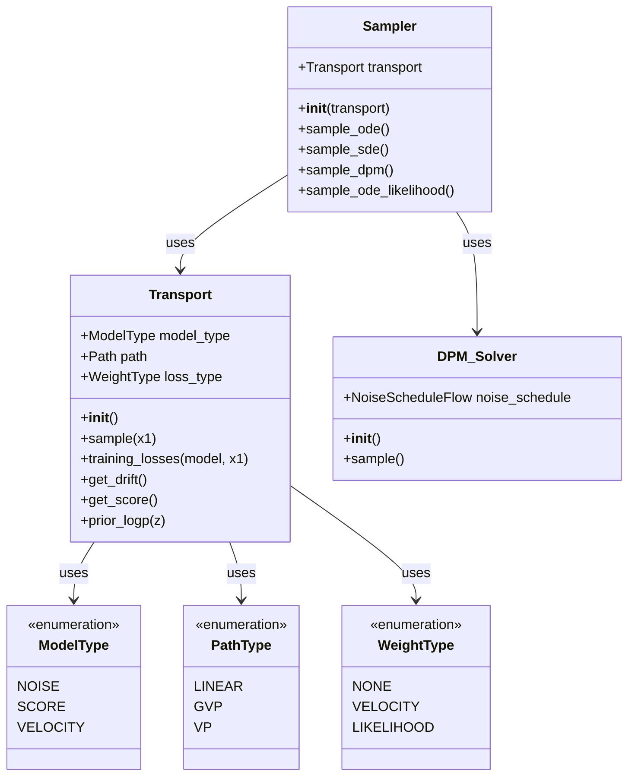
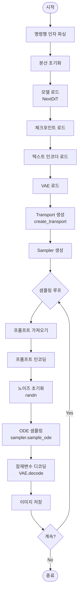
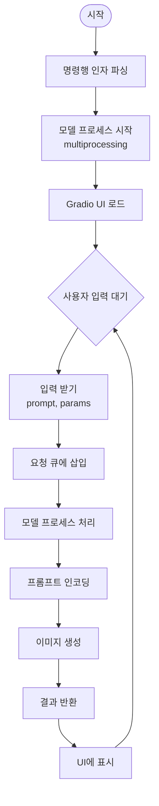
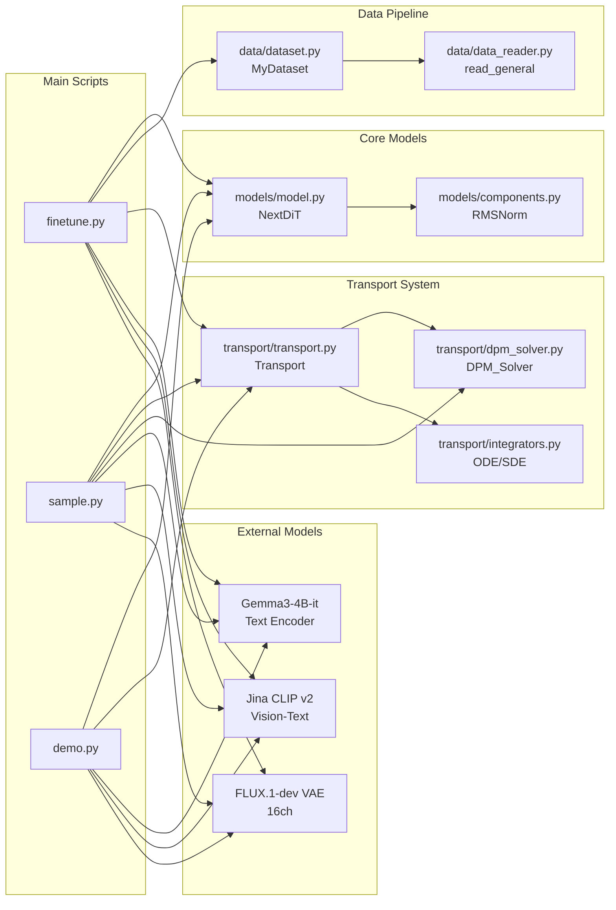
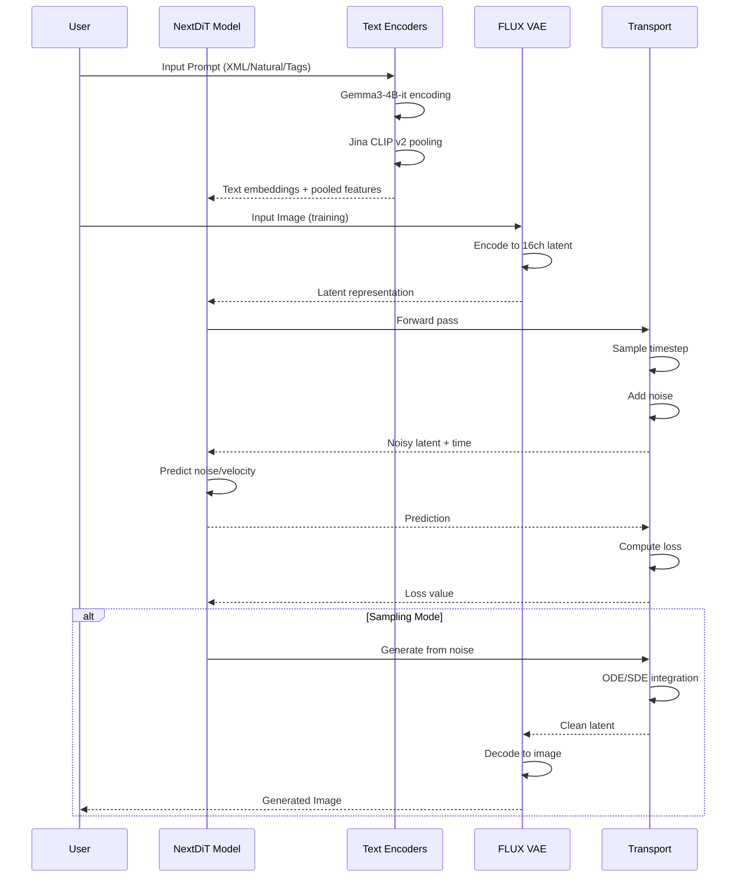
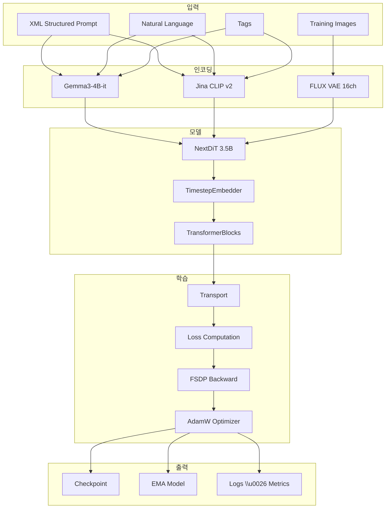

# NewBie Image Exp0.1 - 프로젝트 아키텍처 문서

## 프로젝트 개요

**NewBie image Exp0.1**은 Next-DiT에 기반한 3.5B 파라미터 규모의 DiT(Diffusion Transformer) 모델로, 텍스트-이미지 생성을 위한 실험적 프레임워크입니다.

---

## 1. 폴더 구조

```mermaid
graph TD
    Root[NewBie-image-Exp0.1] --> configs[configs/]
    Root --> data[data/]
    Root --> models[models/]
    Root --> transport[transport/]
    Root --> scripts[scripts/]
    Root --> util[util/]
    
    Root --> finetune[finetune.py<br/>파인튜닝 메인 스크립트]
    Root --> sample[sample.py<br/>샘플링 스크립트]
    Root --> demo[demo.py<br/>Gradio 데모]
    Root --> parallel[parallel.py<br/>분산 학습]
    Root --> imgproc[imgproc.py<br/>이미지 전처리]
    Root --> grad_norm[grad_norm.py<br/>그래디언트 정규화]
    
    configs --> data_yaml[data.yaml]
    
    data --> data_init[__init__.py]
    data --> dataset[dataset.py<br/>데이터셋 클래스]
    data --> data_reader[data_reader.py<br/>데이터 읽기]
    
    models --> models_init[__init__.py]
    models --> model[model.py<br/>메인 모델]
    models --> components[components.py<br/>RMSNorm 등]
    
    transport --> transport_init[__init__.py]
    transport --> transport_py[transport.py<br/>Transport 클래스]
    transport --> dpm_solver[dpm_solver.py<br/>DPM Solver]
    transport --> integrators[integrators.py<br/>ODE/SDE 적분기]
    transport --> path[path.py<br/>Path 정의]
    transport --> utils[utils.py<br/>유틸리티]
    
    scripts --> run_finetune[run_1024_finetune.sh]
    scripts --> sample_sh[sample.sh]
    
    util --> misc[misc.py]
```

---

## 2. 주요 클래스 다이어그램

### 2.1 모델 구조 (models/)

### 2.2 데이터 처리 (data/)

### 2.3 Transport 시스템 (transport/)

---

## 3. 실행 흐름도

### 3.1 학습 프로세스 (finetune.py)

```mermaid
flowchart TD
    Start([시작]) --> ParseArgs[명령행 인자 파싱]
    ParseArgs --> InitDist[분산 학습 초기화<br/>distributed_init]
    InitDist --> LoadModel[모델 로드<br/>NextDiT]
    LoadModel --> LoadTextEncoder[텍스트 인코더 로드<br/>Gemma3-4B-it + Jina CLIP v2]
    LoadTextEncoder --> LoadVAE[VAE 로드<br/>FLUX.1-dev 16ch]
    LoadVAE --> SetupFSDP[FSDP 설정<br/>setup_fsdp_sync]
    SetupFSDP --> CreateDataset[데이터셋 생성<br/>MyDataset]
    CreateDataset --> CreateDataloader[데이터로더 생성<br/>with bucket sampler]
    CreateDataloader --> CreateOptimizer[옵티마이저 생성<br/>AdamW]
    CreateOptimizer --> TrainLoop{학습 루프}
    
    TrainLoop --> GetBatch[배치 가져오기]
    GetBatch --> EncodePrompt[프롬프트 인코딩<br/>encode_prompt]
    EncodePrompt --> EncodeImage[이미지 인코딩<br/>VAE.encode]
    EncodeImage --> SampleTimestep[타임스텝 샘플링]
    SampleTimestep --> ForwardModel[모델 순전파<br/>model.forward]
    ForwardModel --> ComputeLoss[손실 계산<br/>transport.training_losses]
    ComputeLoss --> Backward[역전파]
    Backward --> UpdateWeights[가중치 업데이트]
    UpdateWeights --> UpdateEMA[EMA 업데이트<br/>update_ema]
    UpdateEMA --> SaveCheckpoint{체크포인트 저장?}
    SaveCheckpoint -->|Yes| Save[체크포인트 저장]
    SaveCheckpoint -->|No| CheckContinue{계속?}
    Save --> CheckContinue
    CheckContinue -->|Yes| TrainLoop
    CheckContinue -->|No| End([종료])
```

### 3.2 샘플링 프로세스 (sample.py)

### 3.3 데모 프로세스 (demo.py)

---

## 4. 컴포넌트 간 의존성

---

## 5. 주요 기능 모듈

### 5.1 모델 아키텍처
- **NextDiT**: 메인 Diffusion Transformer 모델 (3.5B 파라미터)
- **TimestepEmbedder**: 타임스텝을 벡터로 임베딩
- **JointAttention**: Flash Attention을 사용한 멀티헤드 어텐션
- **FeedForward**: SwiGLU 활성화 함수를 사용한 FFN
- **RMSNorm**: Root Mean Square Layer Normalization

### 5.2 텍스트 인코더
- **Gemma3-4B-it**: 주요 텍스트 인코더 (penultimate layer 사용)
- **Jina CLIP v2**: 풀링된 텍스트 특징 추출 및 AdaLN 조건화

### 5.3 데이터 처리
- **MyDataset**: 커스텀 데이터셋 클래스, 버킷 기반 배치 처리
- **T2IItemProcessor**: 텍스트-이미지 데이터 전처리
- **Aspect Ratio Bucketing**: 다양한 해상도 지원

### 5.4 Transport 시스템
- **Transport**: 학습 및 샘플링을 위한 전송 프레임워크
- **Sampler**: ODE/SDE 기반 샘플링
- **DPM-Solver**: 고속 샘플링을 위한 Diffusion Probabilistic Model Solver

### 5.5 분산 학습
- **FSDP**: Fully Sharded Data Parallel
- **Mixed Precision**: BF16/FP32 혼합 정밀도 학습
- **Gradient Clipping**: 그래디언트 정규화

---

## 6. 데이터 흐름

---

## 7. 주요 파일 설명

| 파일 | 설명 | 주요 클래스/함수 |
|------|------|------------------|
| `finetune.py` | 메인 학습 스크립트 | `main()`, `encode_prompt()`, `setup_fsdp_sync()` |
| `sample.py` | 샘플링 스크립트 | `main()`, `encode_prompt()` |
| `demo.py` | Gradio 데모 인터페이스 | `main()`, `model_main()`, `on_submit()` |
| `models/model.py` | NextDiT 모델 정의 | `NextDiT`, `JointAttention`, `FeedForward`, `TransformerBlock` |
| `models/components.py` | 컴포넌트 | `RMSNorm` |
| `data/dataset.py` | 데이터셋 클래스 | `MyDataset`, `ItemProcessor` |
| `data/data_reader.py` | 데이터 읽기 | `read_general()` |
| `transport/transport.py` | Transport 프레임워크 | `Transport`, `Sampler`, `ModelType`, `PathType` |
| `transport/dpm_solver.py` | DPM Solver | `DPM_Solver`, `NoiseScheduleFlow` |
| `transport/integrators.py` | ODE/SDE 적분기 | `ode()`, `sde()` |
| `imgproc.py` | 이미지 전처리 | `generate_crop_size_list()`, `center_crop()` |
| `parallel.py` | 분산 학습 유틸 | `distributed_init()`, `get_intra_node_process_group()` |

---

## 8. 학습 파이프라인 요약

---

## 9. 시스템 요구사항

- **GPU**: CUDA 지원 GPU (최소 24GB VRAM 권장)
- **Python**: 3.8+
- **주요 라이브러리**:
  - PyTorch 2.0+
  - Transformers
  - Diffusers
  - Flash Attention (선택 사항, 성능 향상)
  - FSDP (분산 학습)

---

## 10. 확장 가능성

1. **LoRA 파인튜닝**: [NewbieLoraTrainer](https://github.com/NewBieAI-Lab/NewbieLoraTrainer)
2. **ComfyUI 통합**: [ComfyUI-Newbie-V0.1](https://github.com/NewBieAI-Lab/ComfyUI-Newbie-V0.1)
3. **커스텀 데이터셋**: XML 구조화 프롬프트 지원
4. **멀티 해상도**: Aspect ratio bucketing

---

이 문서는 NewBie image Exp0.1 프로젝트의 전체 아키텍처를 시각화하고 설명합니다.
